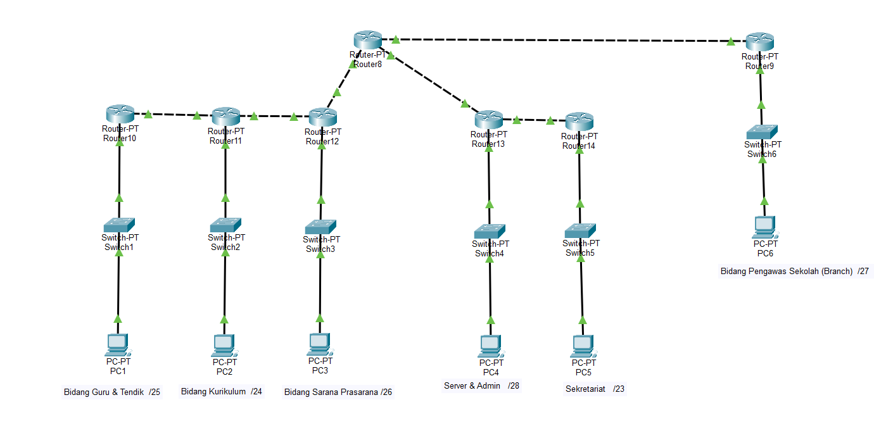
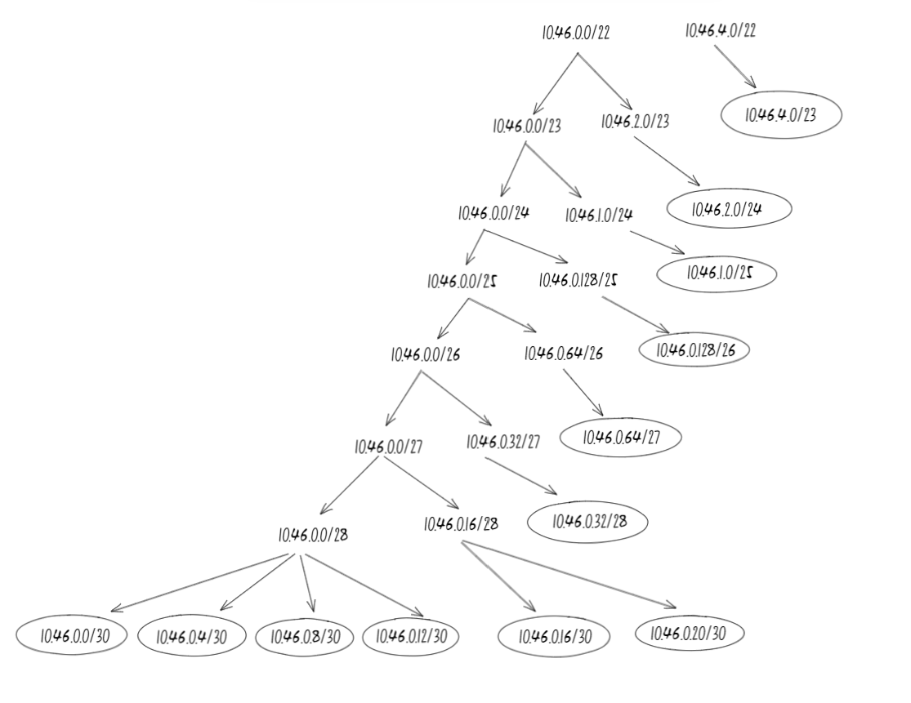
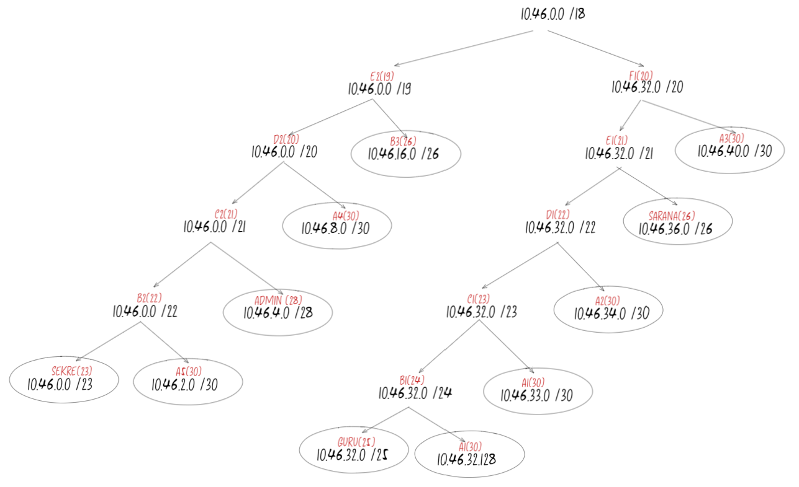

# Tugas-1-Jarkom_Nabilah-Anindya_006

### IP PREFIX = 10.46.0.0

## TOPOLOGI

## Ringkasan Alokasi IP
| SUBNET | JUMLAH IP | NETMASK |
|:-----------------------------|:-----------:|:---------:|
| Bidang Guru & Tendik | 96 host | /25 |
| Bidang Kurikulum | 221 host | /24 |
| Bidang Sarana Prasarana | 46 host | /26 |
| Bidang Pengawas Sekolah (Branch) | 19 host | /27 |
| Server & Admin | 7 host | /28 |
| Sekretariat | 381 host | /23 |
| A1 | 2 host | /30 |
| A2 | 2 host | /30 |
| A3 | 2 host | /30 |
| A4 | 2 host | /30 |
| A5 | 2 host | /30 |
| A6 | 2 host | /30 |
| **TOTAL** | **782 host** | **/22** |

## VSLM

| Bidang / Subnet | NID | Netmask | Broadcast Address | Available Host | Range Available IP | Range Block |
|:-----------------------------|:----------------|:-----------------|:------------------|:----------------:|:-------------------------------|:-------------------------------|
| **Sekretariat** | 10.46.0.0 | 255.255.254.0 | 10.46.1.255 | 510 | 10.46.0.1 – 10.46.1.254 | 10.46.0.0 – 10.46.1.255 |
| **Bidang Kurikulum** | 10.46.33.0 | 255.255.255.0 | 10.46.33.255 | 254 | 10.46.33.1 – 10.46.33.254 | 10.46.33.0 – 10.46.33.255 |
| **Bidang Guru & Tendik** | 10.46.32.0 | 255.255.255.128 | 10.46.32.127 | 126 | 10.46.32.1 – 10.46.32.126 | 10.46.32.0 – 10.46.32.127 |
| **Bidang Sarana Prasarana** | 10.46.35.0 | 255.255.255.192 | 10.46.35.63 | 62 | 10.46.35.1 – 10.46.35.62 | 10.46.35.0 – 10.46.35.63 |
| **Bidang Pengawas** | 10.46.16.0 | 255.255.255.224 | 10.46.16.31 | 30 | 10.46.16.1 – 10.46.16.30 | 10.46.16.0 – 10.46.16.31 |
| **Server & Admin** | 10.46.4.0 | 255.255.255.240 | 10.46.4.15 | 14 | 10.46.4.1 – 10.46.4.14 | 10.46.4.0 – 10.46.4.15 |
| **A1** | 10.46.2.0 | 255.255.255.252 | 10.46.2.3 | 2 | 10.46.2.1 – 10.46.2.2 | 10.46.2.0 – 10.46.2.3 |
| **A2** | 10.46.8.0 | 255.255.255.252 | 10.46.8.3 | 2 | 10.46.8.1 – 10.46.8.2 | 10.46.8.0 – 10.46.8.3 |
| **A3** | 10.46.32.128 | 255.255.255.252 | 10.46.32.131 | 2 | 10.46.32.129 – 10.46.32.130 | 10.46.32.128 – 10.46.32.131 |
| **A4** | 10.46.34.0 | 255.255.255.252 | 10.46.34.3 | 2 | 10.46.34.1 – 10.46.34.2 | 10.46.34.0 – 10.46.34.3 |
| **A5** | 10.46.40.0 | 255.255.255.252 | 10.46.40.3 | 2 | 10.46.40.1 – 10.46.40.2 | 10.46.40.0 – 10.46.40.3 |
| **A6** | 10.46.16.32 | 255.255.255.252 | 10.46.16.35 | 2 | 10.46.16.33 – 10.46.16.34 | 10.46.16.32 – 10.46.16.35 |

---

## CIDR

| Bidang / Subnet | Alokasi CIDR | NID | Netmask | Broadcast Address | Available Host | Range Available IP | Range Block |
|:-----------------------------|:------------------|:----------------|:-----------------|:------------------|:----------------:|:-------------------------------|:-------------------------------|
| **Sekretariat** | 10.46.0.0/23 | 10.46.0.0 | 255.255.254.0 | 10.46.1.255 | 510 | 10.46.0.1 – 10.46.1.254 | 10.46.0.0 – 10.46.1.255 |
| **Bidang Kurikulum** | 10.46.33.0/24 | 10.46.33.0 | 255.255.255.0 | 10.46.33.255 | 254 | 10.46.33.1 – 10.46.33.254 | 10.46.33.0 – 10.46.33.255 |
| **Bidang Guru & Tendik** | 10.46.32.0/25 | 10.46.32.0 | 255.255.255.128 | 10.46.32.127 | 126 | 10.46.32.1 – 10.46.32.126 | 10.46.32.0 – 10.46.32.127 |
| **Bidang Sarana Prasarana** | 10.46.35.0/26 | 10.46.35.0 | 255.255.255.192 | 10.46.35.63 | 62 | 10.46.35.1 – 10.46.35.62 | 10.46.35.0 – 10.46.35.63 |
| **Bidang Pengawas** | 10.46.16.0/27 | 10.46.16.0 | 255.255.255.224 | 10.46.16.31 | 30 | 10.46.16.1 – 10.46.16.30 | 10.46.16.0 – 10.46.16.31 |
| **Server & Admin** | 10.46.4.0/28 | 10.46.4.0 | 255.255.255.240 | 10.46.4.15 | 14 | 10.46.4.1 – 10.46.4.14 | 10.46.4.0 – 10.46.4.15 |
| **A1** | 10.46.2.0/30 | 10.46.2.0 | 255.255.255.252 | 10.46.2.3 | 2 | 10.46.2.1 – 10.46.2.2 | 10.46.2.0 – 10.46.2.3 |
| **A2** | 10.46.8.0/30 | 10.46.8.0 | 255.255.255.252 | 10.46.8.3 | 2 | 10.46.8.1 – 10.46.8.2 | 10.46.8.0 – 10.46.8.3 |
| **A3** | 10.46.32.128/30 | 10.46.32.128 | 255.255.255.252 | 10.46.32.131 | 2 | 10.46.32.129 – 10.46.32.130 | 10.46.32.128 – 10.46.32.131 |
| **A4** | 10.46.34.0/30 | 10.46.34.0 | 255.255.255.252 | 10.46.34.3 | 2 | 10.46.34.1 – 10.46.34.2 | 10.46.34.0 – 10.46.34.3 |
| **A5** | 10.46.40.0/30 | 10.46.40.0 | 255.255.255.252 | 10.46.40.3 | 2 | 10.46.40.1 – 10.46.40.2 | 10.46.40.0 – 10.46.40.3 |
| **A6** | 10.46.16.32/30 | 10.46.16.32 | 255.255.255.252 | 10.46.16.35 | 2 | 10.46.16.33 – 10.46.16.34 | 10.46.16.32 – 10.46.16.35 |

---
